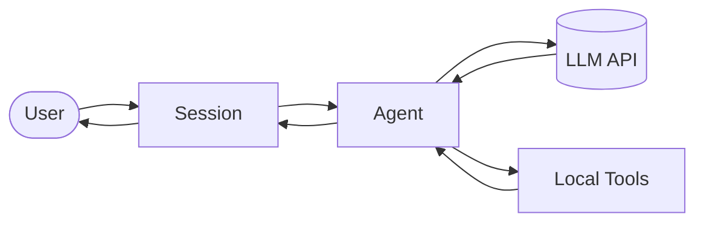
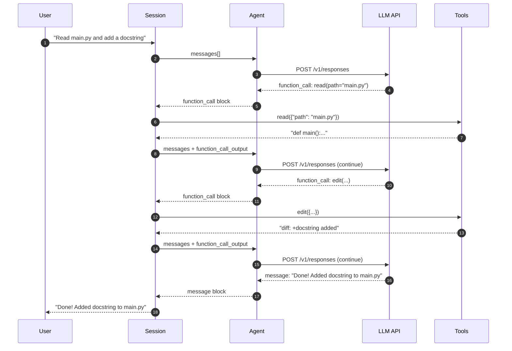
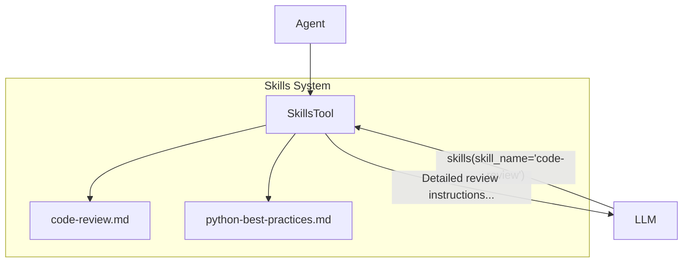
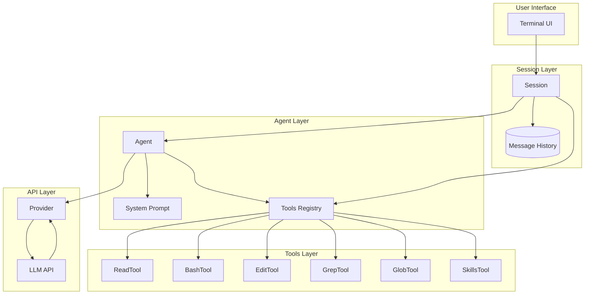

# How AI Coding Agents Work

This document explains how AI coding agents (like Claude Code, OpenAI Codex CLI, or this smolcode project) work under the hood. We'll use smolcode as a concrete, minimal example to illustrate the key concepts.

> [!TIP]
> Despite the hype around AI tooling, building a functional coding agent requires **zero external dependencies**. smolcode proves this—it's built entirely with Python's standard library (`urllib`, `json`, `subprocess`, `dataclasses`). No LangChain, no LlamaIndex, no MCP, no ACP, no `<whatever>`P: no frameworks. The core concepts are simple enough that you can implement them yourself in an afternoon.

## Table of Contents

1. [The Big Picture](#the-big-picture)
2. [Core Components](#core-components)
3. [The Agent Loop](#the-agent-loop)
4. [Tools: Giving the AI Hands](#tools-giving-the-ai-hands)
5. [The System Prompt: Shaping Behavior](#the-system-prompt-shaping-behavior)
6. [Skills: Dynamic Instruction Loading](#skills-dynamic-instruction-loading)
7. [Putting It All Together](#putting-it-all-together)

---

## The Big Picture

You might expect building an AI agent to require complex Agent libraries or specialized frameworks. It doesn't. An AI coding agent is essentially a **loop** that:
1. Takes user input
2. Sends it to an LLM (Large Language Model) along with available tools
3. Executes any tool calls the LLM requests
4. Feeds tool results back to the LLM
5. Repeats until the LLM responds with just text (no more tool calls)



The key insight is that **the LLM doesn't execute code directly**. Instead, it outputs structured "function calls" that your application interprets and executes locally.

---

## Core Components

### 1. The Session

The `Session` is the orchestrator. It manages:
- The conversation history (messages)
- User input handling
- The main loop that coordinates everything

```python
# app/session.py (simplified)
@dataclass
class Session:
    agent: AgentName
    messages: list[Input] = field(default_factory=list)

    def step(self) -> None:
        while True:
            response = self.get_agent().call(self.messages)
            
            for block in response["output"]:
                if block["type"] == "message":
                    # LLM responded with text - we're done
                    content = block["content"][0]["text"]
                    self.messages.append(Message(role="assistant", content=content))
                    return
                
                if block["type"] == "function_call":
                    # LLM wants to use a tool - execute it
                    function_call = FunctionCall(
                        call_id=block["call_id"],
                        name=block["name"],
                        arguments=block.get("arguments", "{}"),
                    )
                    result = self.run_tool(function_call)
                    
                    # Add both the call and result to history
                    self.messages += [function_call, result]
```

### 2. The Agent

The `Agent` wraps the LLM interaction. It holds:
- The model name (e.g., `gpt-4`, `claude-3`)
- System instructions (the prompt that shapes behavior)
- Available tools and their schemas

```python
# app/agents/base_agent.py
@dataclass
class Agent:
    model: str
    instructions: str
    tools: dict[str, Tool]

    def __post_init__(self):
        # Convert tools to JSON schemas the API understands
        self.tools_schema: list[ToolSchema] = []
        for tool_name, tool in self.tools.items():
            self.tools_schema.append(tool.make_schema(tool_name))

    def call(self, messages: list[Input]):
        return call_api(
            messages,
            self.model,
            self.instructions,
            self.tools_schema,
        )
```

### 3. The Provider

The `Provider` handles the actual HTTP communication with the LLM API. Notice how simple this is—just a plain HTTP POST request using Python's built-in `urllib`. No SDK required:

```python
# app/provider.py
API_URL = "https://api.openai.com/v1/responses"

def call_api(
    messages: list[Input],
    model: str,
    system_prompt: str,
    tools_schema: list[ToolSchema],
) -> dict[str, Any]:
    payload = json.dumps({
        "model": model,
        "max_output_tokens": 8192,
        "instructions": system_prompt,
        "input": [asdict(m) for m in messages],
        "tools": [asdict(schema) for schema in tools_schema],
    }).encode()

    request = urllib.request.Request(
        API_URL,
        data=payload,
        headers={
            "Content-Type": "application/json",
            "Authorization": f"Bearer {OPENAI_API_KEY}",
        },
    )
    response = urllib.request.urlopen(request)
    return json.loads(response.read())
```

---

## The Agent Loop

This is the heart of any coding agent. The loop continues until the LLM decides it has enough information to respond with just text.



The key pattern:
1. **LLM outputs `function_call`** → Execute the tool, feed result back, continue
2. **LLM outputs `message`** → Display to user, stop the loop

---

## Tools: Giving the AI Hands

Tools are what make an agent actually useful. Without tools, an LLM can only generate text. With tools, it can read files, run commands, search codebases, and modify code.

### Anatomy of a Tool

Each tool has three parts:
1. **Schema**: JSON description the LLM sees (name, description, parameters)
2. **Implementation**: Python function that actually does the work
3. **Output**: Text result returned to the LLM

```python
# app/tools/base_tool.py
@dataclass
class Tool(ABC):
    description: ClassVar[str]
    args: ClassVar[dict[str, str]]

    def make_schema(self, name: str) -> ToolSchema:
        """Generate JSON Schema for the LLM API"""
        properties = {}
        required = []
        for param_name, param_type in self.args.items():
            is_optional = param_type.endswith("?")
            base_type = param_type.rstrip("?")
            properties[param_name] = {"type": base_type}
            if not is_optional:
                required.append(param_name)

        return ToolSchema(
            name=name,
            description=self.description,
            parameters={
                "type": "object",
                "properties": properties,
                "required": required,
            },
        )

    @abstractmethod
    def __call__(self, args) -> str:
        """Execute the tool and return text result"""
        raise NotImplementedError
```

### Example: Read Tool

```python
# app/tools/read.py
class ReadTool(Tool):
    description = "Read file with line numbers (file path, not directory)"
    args = {"path": "string", "offset": "number?", "limit": "number?"}

    def __call__(self, args):
        with open(args["path"]) as fd:
            lines = fd.readlines()

        offset = args.get("offset", 0)
        limit = args.get("limit", len(lines))
        selected = lines[offset : offset + limit]

        # Return with line numbers for context
        return "".join(
            f"{offset + idx + 1:4}| {line}" for idx, line in enumerate(selected)
        )
```

### Example: Bash Tool

```python
# app/tools/bash.py
class BashTool(Tool):
    description = "Run bash command"
    args = {"cmd": "string"}

    def __call__(self, args):
        result = subprocess.run(
            args["cmd"], shell=True, capture_output=True, text=True, timeout=30
        )
        return (result.stdout + result.stderr).strip() or "(No content)"
```

### The Tool Schema → LLM

When you register tools with the agent, they're converted to JSON schemas:

```json
{
  "name": "read",
  "type": "function",
  "description": "Read file with line numbers (file path, not directory)",
  "parameters": {
    "type": "object",
    "properties": {
      "path": {"type": "string"},
      "offset": {"type": "integer"},
      "limit": {"type": "integer"}
    },
    "required": ["path"]
  }
}
```

The LLM sees this schema and can decide to call the tool by outputting:

```json
{
  "type": "function_call",
  "call_id": "call_abc123",
  "name": "read",
  "arguments": "{\"path\": \"main.py\"}"
}
```

---

## The System Prompt: Shaping Behavior

The system prompt (or "instructions") is crucial. It defines:
- The agent's personality and communication style
- How it should approach tasks
- What guidelines to follow
- How to present work to the user

```python
# app/agents/build.py
base_instructions = (Path(__file__).parent / "prompt" / "base.txt").read_text()

agent = Agent(
    model="gpt-5.2",
    instructions=instructions.format(path=os.getcwd()),
    tools={
        "read": ReadTool(),
        "glob": GlobTool(),
        "bash": BashTool(),
        "grep": GrepTool(),
        "edit": EditTool(),
        "webfetch": WebFetchTool(),
        "skills": SkillsTool(),
    },
)
```

A typical system prompt includes:

1. **Role definition**: "You are a coding agent running in a terminal..."
2. **Capabilities**: What the agent can do
3. **Task execution guidelines**: "Keep going until the task is complete..."
4. **Code style rules**: "Keep changes consistent with existing codebase..."
5. **Output formatting**: How to present results

---

## Skills: Dynamic Instruction Loading

Skills are an elegant pattern for loading specialized instructions on-demand, keeping the base prompt lean while allowing deep expertise when needed.



### How Skills Work

Skills are markdown files that contain specialized instructions:

```markdown
---
Perform thorough code reviews focusing on bugs, security, and best practices
---

# Code Review Skill

When reviewing code, focus on:
1. Logic errors and edge cases
2. Security vulnerabilities
3. Performance issues
4. Code style consistency
...
```

The `SkillsTool` loads these dynamically:

```python
# app/skills/skill.py
@dataclass
class Skill:
    name: str
    description: str | None
    content: str

    @classmethod
    def from_file(cls, f: Path) -> Self:
        name = f.name.rstrip(".md")
        content = f.read_text().strip()
        
        # Parse frontmatter for description
        if content.startswith("---"):
            lines = content.split("\n")
            description = lines[1]
            content = "\n".join(lines[2:])
            return cls(name=name, content=content, description=description)
        
        return cls(name=name, content=content, description=None)


class SkillsTool(Tool):
    description = "Load a skill for detailed task instructions..."
    
    def __call__(self, args) -> str:
        skill_name = args["skill_name"]
        return skills[skill_name].content
```

When the LLM needs to do a code review, it can call `skills(skill_name="code-review")` to load specialized instructions into the conversation.

---

## Putting It All Together

Here's the complete data flow:



---

## Key Takeaways

1. **No frameworks needed**: The entire agent pattern is just HTTP requests, JSON parsing, and a while loop. Python's standard library is enough.

2. **The LLM is the brain, tools are the hands**: The LLM decides what to do; your code executes it locally.

3. **The loop is simple**: Call LLM → Execute tools → Feed results back → Repeat until text response.

4. **Tools need schemas**: The LLM needs to know what tools exist and how to call them via JSON schemas.

5. **System prompts shape behavior**: A well-crafted prompt makes the difference between a helpful agent and a frustrating one.

6. **Skills enable specialization**: Load domain-specific instructions on-demand without bloating the base prompt.

7. **Message history is state**: Everything the agent knows comes from the conversation history—there's no hidden memory.

---

## Why No Dependencies?

You might wonder: why does smolcode avoid libraries like `requests`, `openai`, or frameworks like LangChain?

| What you might use | What smolcode uses instead |
|--------------------|---------------------------|
| `requests` | `urllib.request` (built-in) |
| `openai` SDK | Raw HTTP POST to the API |
| `pydantic` | `dataclasses` (built-in) |
| LangChain/LlamaIndex | A simple while loop |
| Rich/Textual TUI | ANSI escape codes |

**Benefits of this approach**:
- **Transparency**: Every line of code is yours to understand and modify
- **No version conflicts**: Standard library doesn't break between Python versions
- **Learning**: You actually understand what's happening, not just calling magic functions
- **Portability**: Runs anywhere Python runs, no `pip install` required
- **Hackability**: Want to change something? Just edit the code—no framework conventions to follow

The AI agent pattern is fundamentally simple. Frameworks often add complexity without adding proportional value. smolcode proves you can build a fully functional coding agent in ~500 lines of dependency-free Python.
