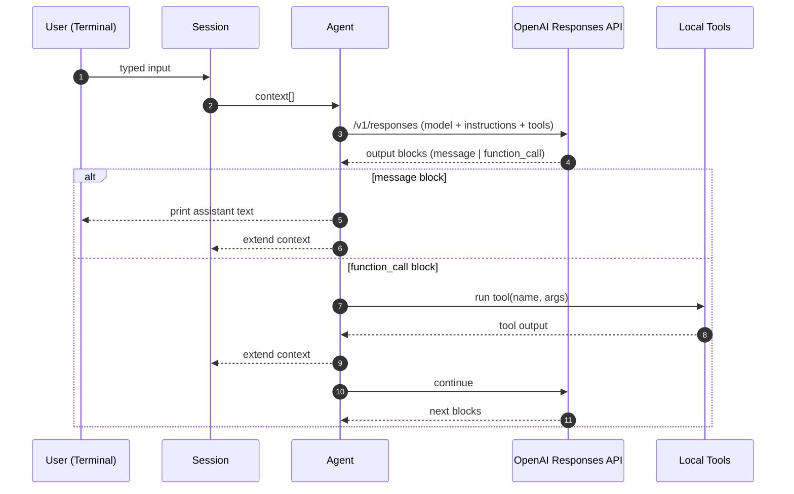
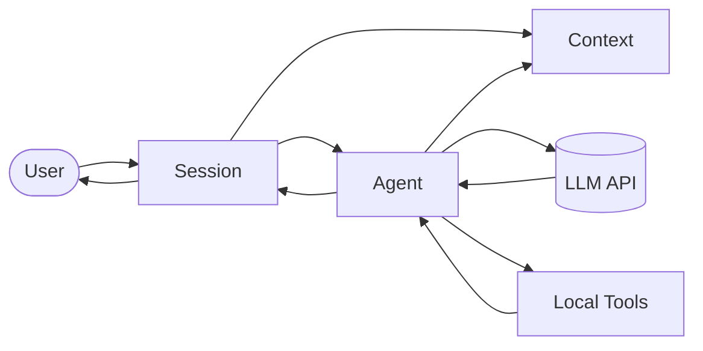

# smolcode

A minimal, no-dependency, hackable CLI coding agent.

It runs a simple chat loop, lets the model call a small set of local tools (read files, search, run shell commands, edit files), and supports “skills” as reusable instruction packs.

> [!TIP]
> See [LEARN.md](./LEARN.md) to learn more about AI coding agents.


> [!NOTE]
> The documentation below, [LEARN.md](./LEARN.md) and [this commit](https://github.com/mlorthiois/smolcode/commit/e753610a78ceedd09d1b55c38727f0bca817ddb3) were 100% written by smolcode.

---

## What It Does

- Interactive terminal session (prompt/response loop) with a single agent model.
- Multiple agents with switcher: Build and Plan Agents
- Subagents: delegates focused subtasks to specialized worker agents and merges results
- Conversation compaction
- Tool calling:
  - Read files with line numbers
  - Search the workspace (glob + regex grep)
  - Run local shell commands
  - Apply safe, exact-text edits to files
- Skills system: load task-specific instruction bundles (e.g. code review, python best practices) to steer behavior.
- Lightweight UI rendering: shows tool calls and previews results while you work.

## How The Repo Is Assembled

The project is intentionally small: one CLI entrypoint, one agent wrapper around the API, a session loop, and a handful of tools.

### Main Components

- `app/__init__.py`: CLI entrypoint. Creates a `Session` and starts the loop.
- `app/backend/*`: Orchestrates the conversation:
  - Collects user input, calls the agent, dispatches tool calls, appends tool outputs back into the message stream
- `app/core/*`: Agent primitives described below
- `app/plugins/*`: Usage of primitives: Tools, Skills, Subagents, OpenAI provider, ...
- `app/ui/*`: Terminal output formatting and event sink.
- `config/agents/`: Markdown agent definitions
- `config/subagents/`: Worker agents used for delegated subtasks
- `app/ui/*`: Renderer of backend events

### Control Flow



### Architecture (Modules)



## Requirements

- Python >= 3.13 (see `pyproject.toml`)
- Authentication (one of the following):
  - **API Key**: An OpenAI API key
  - **OAuth**: A ChatGPT Plus/Pro subscription (uses the Codex API)

## Installation

Install with pipx for an isolated CLI (recommended):

```bash
pipx install -e .
```

Or install in a virtual environment:

```bash
pip install -e .
```

Install with uv:

```bash
uv tool install --editable .
```

## Usage

smolcode supports two authentication modes:

### Option 1: API Key Mode

Use your OpenAI API key directly:

```bash
export OPENAI_API_KEY="sk-..."
smolcode
```

### Option 2: OAuth Mode (ChatGPT Plus/Pro)

> [!CAUTION]
> OpenAI OAuth is used because stated as allowed in OSS in this [tweet](https://x.com/thsottiaux/status/2009714843587342393). Please contact me if not authorized.

Use your ChatGPT subscription via OAuth:

```bash
# First, login (opens browser for authentication)
smolcode login

# Then, run smolcode
export SMOLCODE_OAUTH="true"
smolcode
```

The OAuth flow uses PKCE and stores tokens in `~/.config/smolcode/auth.json`.

### In-Session Commands

- `/agent {build|plan}`: Switch current agent session (keep history)
- `/quit` or `/q`: quit
- `/clear` or `/c`: clear the current conversation context

## Configuration

- Default markdown config lives in `config/agents/`, `config/subagents/`, and `config/skills/`.
- Base agent instructions live in `config/agents/common.txt` (override in `$XDG_CONFIG_HOME/smolcode/agents/common.txt`).
- You can add or override agents/subagents/skills in `$XDG_CONFIG_HOME/smolcode` (fallback: `~/.config/smolcode`).
- `$XDG_CONFIG_HOME` takes priority over the repository config during loading.
- Add new tools by implementing `Tool` in `app/tool.py`, then registering them in `app/registry.py`.

> [!NOTE]
> `app/tools/edit.py` implements an exact-text replacement strategy with fallbacks to make edits more robust.
