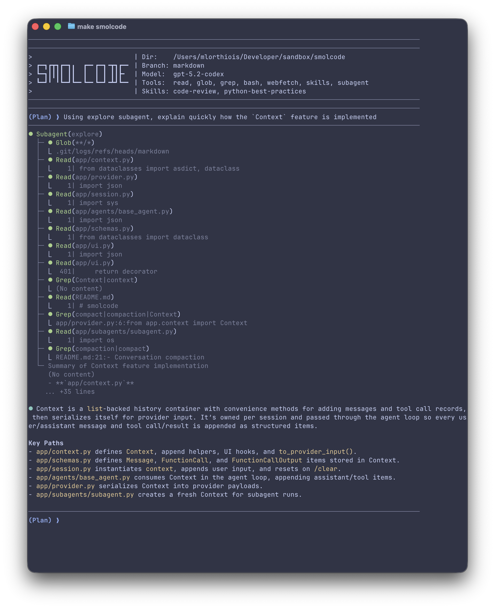
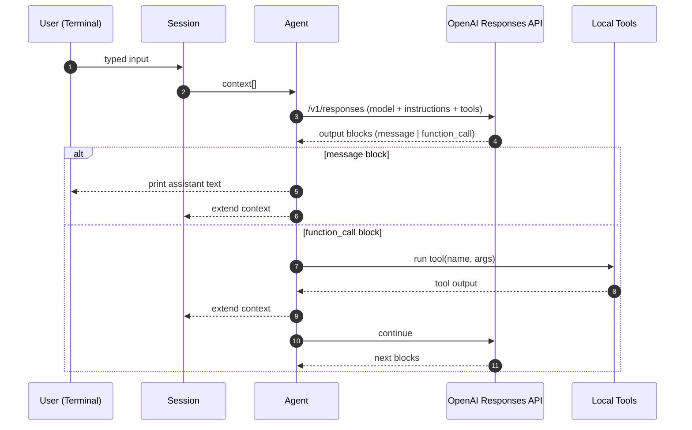
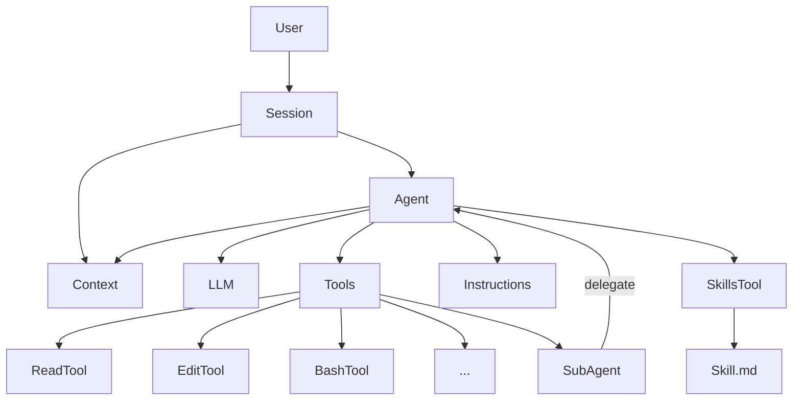

# smolcode

A minimal, no-dependency, hackable CLI coding agent.

It runs a simple chat loop, lets the model call a small set of local tools (read files, search, run shell commands, edit files), and supports “skills” as reusable instruction packs.

> [!TIP]
> See [LEARN.md](./LEARN.md) to learn more about AI coding agents.



> [!NOTE]
> The documentation below, [LEARN.md](./LEARN.md) and [this commit](https://github.com/mlorthiois/smolcode/commit/e753610a78ceedd09d1b55c38727f0bca817ddb3) were 100% written by smolcode.

---

## What It Does

- Interactive terminal session (prompt/response loop) with a single agent model.
- Multiple agents with switcher: Build and Plan Agents
- Subagents: delegates focused subtasks to specialized worker agents and merges results
- Conversation compaction
- Tool calling:
  - Read files with line numbers
  - Search the workspace (glob + regex grep)
  - Run local shell commands
  - Apply safe, exact-text edits to files
- Skills system: load task-specific instruction bundles (e.g. code review, python best practices) to steer behavior.
- Lightweight UI rendering: shows tool calls and previews results while you work. Decorators only TUI.

## How The Repo Is Assembled

The project is intentionally small: one CLI entrypoint, one agent wrapper around the API, a session loop, and a handful of tools.

### Main Components

- `app/main.py`: CLI entrypoint. Creates a `Session` and starts the loop.
- `app/session.py`: Orchestrates the conversation:
  - Collects user input
  - Calls the agent
  - Dispatches tool calls
  - Appends tool outputs back into the message stream
- `app/agent.py`: Defines the `Agent`:
  - Loads base instructions from `config/agents/common.txt`
  - Loads agent markdown from `config/agents/`
  - Registers tools and exposes their JSON schemas to the model
  - Calls the API via `app/provider.py`
- `config/agents/`: Markdown agent definitions
- `config/subagents/`: Worker agents used for delegated subtasks
- `app/provider.py`: Thin client for the OpenAI Responses API (`/v1/responses`). Uses `OPENAI_API_KEY`.
- `app/tools/`: Local tool implementations (and their JSON schemas)
  - `read.py`, `glob.py`, `grep.py`, `bash.py`, `edit.py`
- `config/skills/`: Markdown “skill” files + loader
  - `Registry` scans `config/skills/*.md` and exposes them through a `skills` tool
- `app/ui.py`: Terminal output formatting and decorators used by `Session`.

### Control Flow



### Architecture (Modules)



## Requirements

- Python >= 3.13 (see `pyproject.toml`)
- An OpenAI API key exported as `OPENAI_API_KEY`

## Run It

1) Export your API key:

```bash
export OPENAI_API_KEY="..."
```

2) Start the CLI:

```bash
make smolcode
```

### In-Session Commands

- `/agent {build|plan}`: Switch current agent session (keep history)
- `/quit` or `/q`: quit
- `/clear` or `/c`: clear the current conversation context

## Configuration

- Default markdown config lives in `config/agents/`, `config/subagents/`, and `config/skills/`.
- Base agent instructions live in `config/agents/common.txt` (override in `$XDG_CONFIG_HOME/smolcode/agents/common.txt`).
- You can add or override agents/subagents/skills in `$XDG_CONFIG_HOME/smolcode` (fallback: `~/.config/smolcode`).
- `$XDG_CONFIG_HOME` takes priority over the repository config during loading.
- Add new tools by implementing `Tool` in `app/tool.py`, then registering them in `app/registry.py`.

> [!NOTE]
> `app/tools/edit.py` implements an exact-text replacement strategy with fallbacks to make edits more robust.

## TODO

Of course, this repo is a playground for me. But here's what I'd like to add to it:
- Permission management, especially for read/write/bash tools
