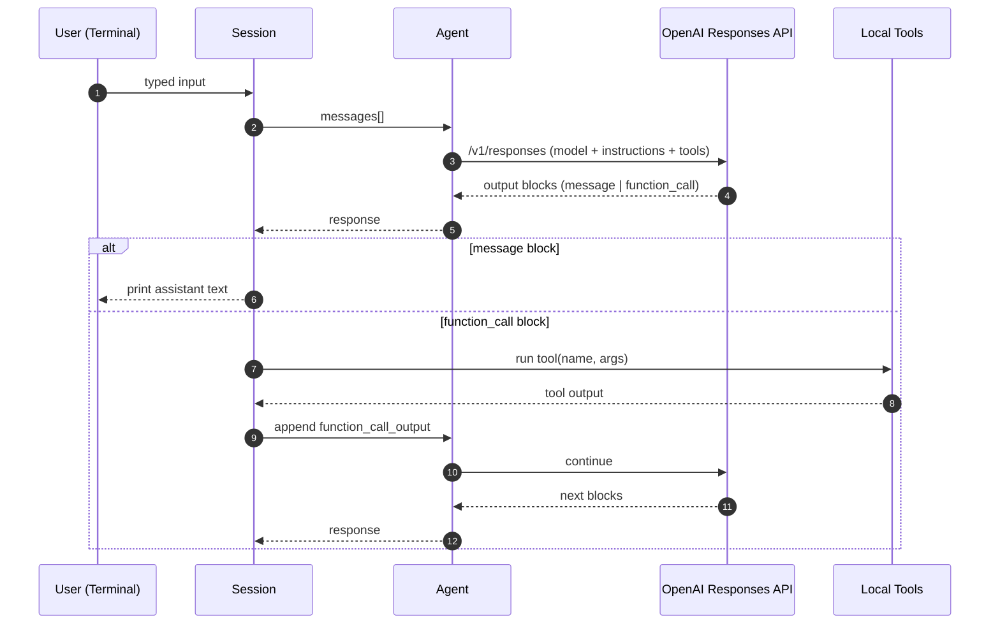
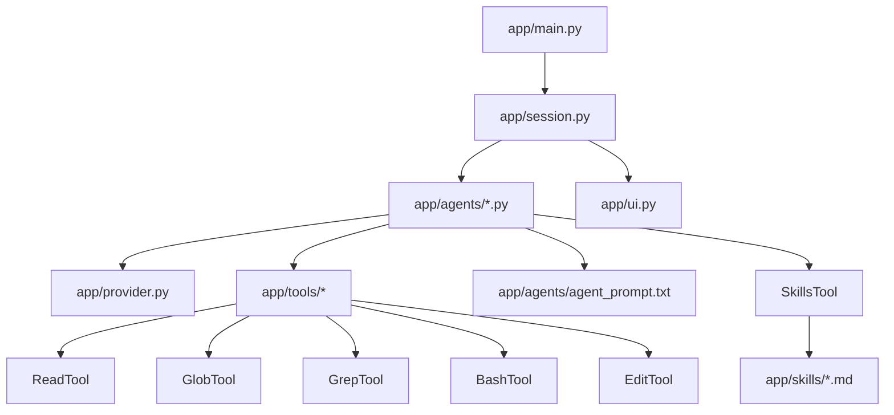

# SmolCode

A minimal, no-dependency, hackable CLI coding agent powered by the OpenAI Responses API.

It runs a simple chat loop, lets the model call a small set of local tools (read files, search, run shell commands, edit files), and supports “skills” as reusable instruction packs.

## Example of conversation

```
────────────────────────────────────────────────────────────────────────────────────────────
────────────────────────────────────────────────────────────────────────────────────────────
>                           | Dir:    /Users/mlorthiois/Developer/smolcode
>  ┏━┓┏┳┓┏━┓╻  ┏━╸┏━┓╺┳┓┏━╸ | Branch: main
>  ┗━┓┃┃┃┃ ┃┃  ┃  ┃ ┃ ┃┃┣╸  | Model:  gpt-5.2
>  ┗━┛╹ ╹┗━┛┗━╸┗━╸┗━┛╺┻┛┗━╸ | Tools:  read, glob, bash, grep, webfetch, skills
>                           | Skills: code-review, python-best-practices
────────────────────────────────────────────────────────────────────────────────────────────
────────────────────────────────────────────────────────────────────────────────────────────
(Build) ❯ Write the documentation for this repo in the README.md file. 
You must include the features offered by this tool (in broad terms, do not list their
specific uses), how the repo architecture is put together, and how to launch it. 
Everything must be in English. Feel free to include mermaid diagrams.
────────────────────────────────────────────────────────────────────────────────────────────
🔵 I start exploring the current project before mering everything together.

🟢 Glob(**/*)
  ⎿ ./app/skills/__init__.py
    ./app/skills/skill.py
    ./app/skills/code-review.md
    ... +39 lines

🟢 Glob(Dockerfile)
  ⎿ (No content)

🟢 Read(pyproject.toml)
  ⎿ 1| [project]
    2| name = "smolcode"
    3| readme = "README.md"
    ... +2 lines

🟢 Read(app/main.py)
  ⎿ 1| from app.agents import agent
    2| from app.session import Session
    3|
    ... +4 lines

[...]

🟢 Bash(ls -la README.md && wc -c README.md && python -V)
  ⎿ -rw-r--r--  1 mlorthiois  staff  7044 Jan 12 21:27 README.md
    7044 README.md
    Python 3.13.5

🔵 I have everything I need, I start writing the documentation.

🟢 Edit(README.md)
  ⎿  {"path": "README.md", "diff": "--- README.md\n+++ README.md\n@@ -0,0 +1,128 @@\n...

🔵 I wrote the repository documentation in `README.md` (in English), including:
- The tool’s main capabilities (high level, without detailed usage)
- How the repo is structured and how components fit together
- How to run it
- Mermaid diagrams (sequence + module architecture)

File updated: `README.md`
────────────────────────────────────────────────────────────────────────────────────────────
(Build) ❯ /agent plan
────────────────────────────────────────────────────────────────────────────────────────────
🟢 Agent switched
────────────────────────────────────────────────────────────────────────────────────────────
(Plan) ❯ Thank you!
────────────────────────────────────────────────────────────────────────────────────────────
🔵 You’re welcome!
```

> This documentation was generated by SmolCode

## What It Does

- Interactive terminal session (prompt/response loop) with a single agent model.
- Multiple agents with switcher: Build and Plan Agents
- Conversation compaction
- Tool calling:
  - Read files with line numbers
  - Search the workspace (glob + regex grep)
  - Run local shell commands
  - Apply safe, exact-text edits to files
- Skills system: load task-specific instruction bundles (e.g. code review, python best practices) to steer behavior.
- Lightweight UI rendering: shows tool calls and previews results while you work. Decorators only TUI.

## How The Repo Is Assembled

The project is intentionally small: one CLI entrypoint, one agent wrapper around the API, a session loop, and a handful of tools.

### Main Components

- `app/main.py`: CLI entrypoint. Creates a `Session` and starts the loop.
- `app/session.py`: Orchestrates the conversation:
  - Collects user input
  - Calls the agent
  - Dispatches tool calls
  - Appends tool outputs back into the message stream
- `app/agents/base_agent.py`: Defines the `Agent`:
  - Loads the system prompt from `app/agents/agent_prompt.txt`
  - Registers tools and exposes their JSON schemas to the model
  - Calls the API via `app/api.py`
- `app/provider.py`: Thin client for the OpenAI Responses API (`/v1/responses`). Uses `OPENAI_API_KEY`.
- `app/tools/`: Local tool implementations (and their JSON schemas)
  - `read.py`, `glob.py`, `grep.py`, `bash.py`, `edit.py`
- `app/skills/`: Markdown “skill” files + loader
  - `skill.py` scans `app/skills/*.md` and exposes them through a `skills` tool
- `app/ui.py`: Terminal output formatting and decorators used by `Session`.

### Control Flow



### Architecture (Modules)



## Requirements

- Python >= 3.13 (see `pyproject.toml`)
- An OpenAI API key exported as `OPENAI_API_KEY`

## Run It

1) Export your API key:

```bash
export OPENAI_API_KEY="..."
```

2) Start the CLI:

```bash
make smolcode
```

### In-Session Commands

- `/agent {build|plan}`: Switch current agent session (keep history)
- `/quit` or `/q`: quit
- `/clear` or `/c`: clear the current conversation context

## Notes

- `app/tools/edit.py` implements an exact-text replacement strategy with fallbacks to make edits more robust.

## Development Tips

- Add new tools by implementing `Tool` in `app/tools/base_tool.py`, then registering them in `app/agent.py`.
- Add new skills by dropping a `*.md` file into `app/skills/`.

## TODO

Of course, this repo is a playground for me. But here's what I'd like to add to it:
- Delegation from a primary agent to a sub-agent
- Permission management, especially for read/write/bash tools
