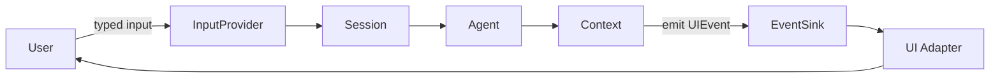
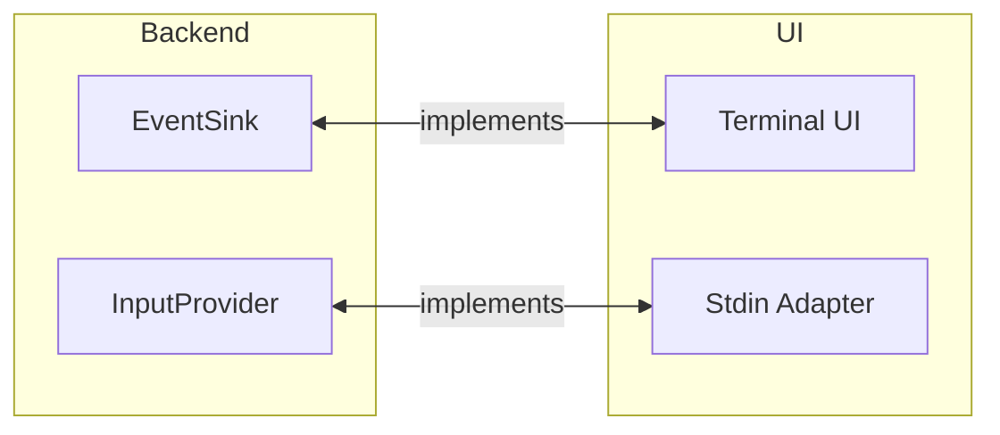
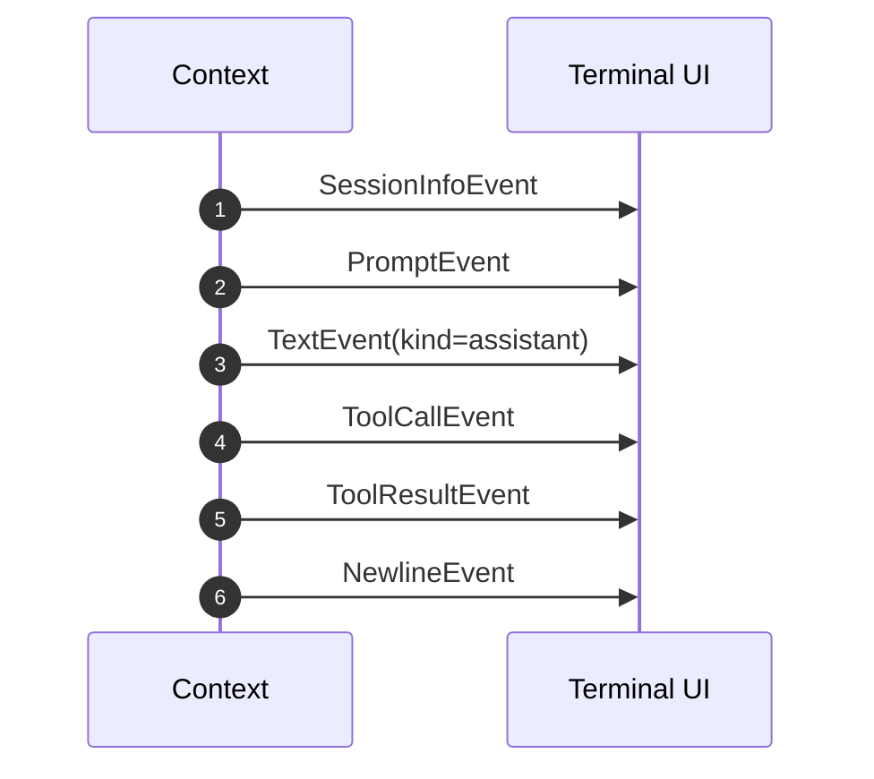
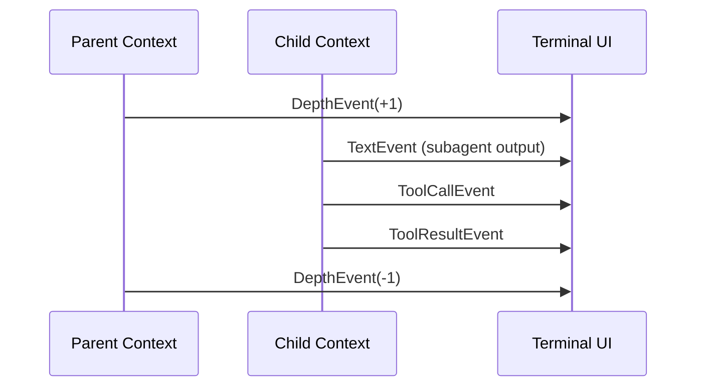
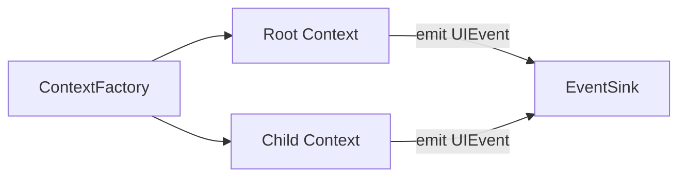
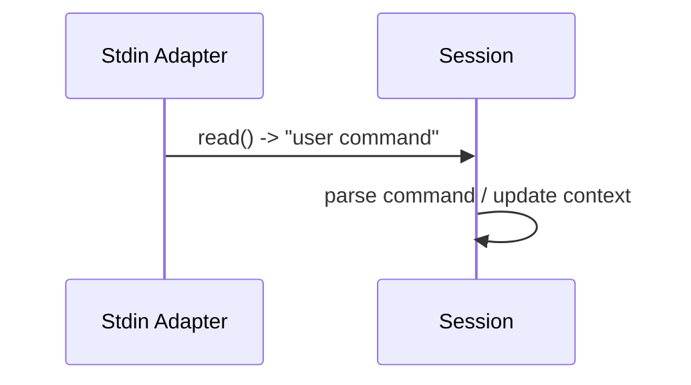

# UI Layer Overview

This document explains how the backend and UI collaborate, focusing on ports, adapters, events, and the runtime flow. It is intentionally conceptual: it describes how the pieces work together rather than where they live.

## Big Picture

The system is split into two roles:
- **Backend**: Owns core logic (session loop, agents, tools, context, and event production).
- **UI**: Consumes backend events and renders them (terminal output, prompts, separators, depth).

Communication is uni-directional:
- Backend emits **UI events** (pure data, no rendering).
- UI consumes those events and renders them.
- User input flows back through an **InputProvider** port.

## Ports and Adapters

### Ports (backend-facing contracts)

Ports are lightweight interfaces that describe how the backend talks to the outside world.

- **EventSink**: receives UI events emitted by backend code.
- **InputProvider**: provides user input to the backend.

These are intentionally minimal. The backend depends only on these contracts, not on a specific UI implementation.

### Adapters (UI-facing implementations)

Adapters implement the ports for a concrete UI.

- The terminal UI **implements EventSink** and renders events.
- The stdin adapter **implements InputProvider** and returns raw user input.

This keeps all rendering and terminal concerns (ANSI, markdown, separators) out of the backend.

## UI Events

Events are plain dataclasses. They carry intent, not rendering logic.

Common event types:
- **SessionInfoEvent**: header info (model, tools, skills, auth, subagents, pwd, branch).
- **PromptEvent**: prompt marker with agent name.
- **TextEvent**: assistant text, reasoning text, or status messages.
- **ToolCallEvent**: tool name + preview of arguments.
- **ToolResultEvent**: output preview + success flag.
- **SeparatorEvent**: a visual divider.
- **NewlineEvent**: explicit spacing.
- **DepthEvent**: push or pop subagent render depth.

UI is free to interpret these events for a specific presentation, but should not modify backend state.

## Context as the Event Emitter

The backend centralizes event emission in the **Context**:
- When messages, reasoning, tool calls, and tool outputs are recorded, the context emits the corresponding events.
- This keeps agents and tools focused on state changes only.

Benefits:
- Single place to control event emission policy.
- Agents remain logic-only.
- Tools can stay unaware of UI details.

## Depth Management for Subagents

Subagents are handled by creating **child contexts**. Depth is a UI concept that only affects rendering.

Behavior:
- Entering a child context emits `DepthEvent(+1)`.
- Exiting emits `DepthEvent(-1)`.
- The terminal UI uses depth to switch renderers (tree-style output).

## ContextFactory: Creating Root and Child Contexts

To avoid passing UI concerns into tools, the backend uses a **ContextFactory**:

- `root()` creates the main context for the session (no depth events).
- `child()` creates a sub-context (depth events enabled).

This factory holds the event sink and ensures consistent wiring without exposing the sink to tools directly.

## Input Flow (Port in the Other Direction)

User input is provided via the `InputProvider` port:
- The UI adapter reads from stdin (or any other source).
- The backend treats input as a plain string.

## Why This Architecture

- **Testability**: the backend can run with a fake EventSink and InputProvider.
- **Replaceable UI**: swap terminal output for another renderer without touching backend logic.
- **Clear ownership**: backend owns state and events, UI owns rendering.

## Summary

- Backend emits pure UI events via a port.
- UI adapters implement the port and render events.
- Context is the single source of truth for state and event emission.
- ContextFactory standardizes root/child context creation and depth handling.
- Input flows back through the InputProvider port.
